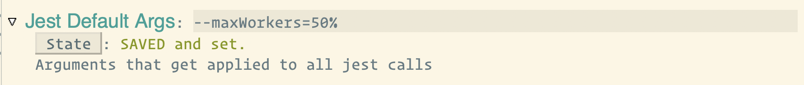
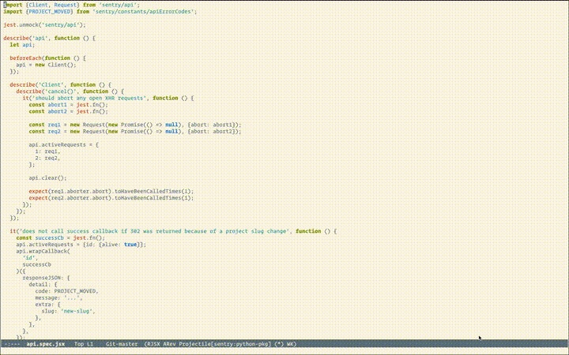
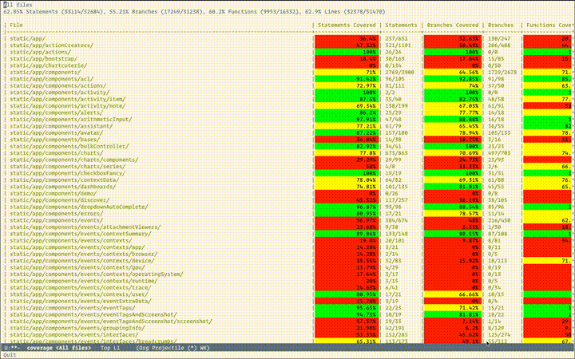

# emacs-jest

This package provides a way to work with [jest](https://jestjs.io/) in [emacs](https://www.gnu.org/software/emacs/)

## Installation

This is still a work in progress and not hosted on a package repository so you would need to clone this repo and load the package.

```bash
$ cd ~/desired/location
$ git clone git@github.com:yevbar/emacs-jest.git
```

Then, in your config file

```elisp
(add-to-list 'load-path "~/desired/location/emacs-jest")
(load "emacs-jest")
```

## Usage

This package introduces a handful of functions for working with jest including:

[Author note: For snippets that could be helpful with the below functions, check out [helpful tips](#helpful-tips)]

### `jest-test-current-file`

This takes the current test file and tests it by taking the jest command output into a compilation buffer (check out [this blog post](https://erick.navarro.io/blog/using-compilation-mode-to-run-all-the-things/) to see more cool usages of `M-x compile`)


### `jest-test-file`

Is an interactive function, provides a prompt to select a file to run jest on

### `jest-test-current-directory`

This takes the current directory and runs jest over the applicable files in the directory

### `jest-test-directory`

Is an interactive function, provides a prompt to select a directory to run jest on

### `jest-test-coverage`

Runs `jest --coverage` over the entire project

### `jest-get-coverage`

Gives you the coverage view for the entire project, you can see a screen recording in the [Making keybinds for quick access](#making-keybinds-for-quick-access) section

### `get-target-coverage`

When viewing a table and you'd like to navigate to the folder/file belonging to the row your cursor is at, you can invoke `M-x get-target-coverage` or press `C-c c`


## Customization

To customize the variables below, `M-x customize-group RET jest RET`

### Jest Coverage Directory

This is the directory that the root `index.html` file is expected (Important: without trailing slash). For `html` coverage reports, this is simply the `coverageDirectory` value in your jest config file. For `lcov` coverage reports, this is the `coverageDirectory` value concatenated with `"/lcov-report"`

### Jest Default Args

These are the command line args that get appended to the jest command before execution so this would be where you put something like [maxWorkers](https://jestjs.io/docs/cli#--maxworkersnumstring).



### Jest Coverage Default Args

Similar to [Jest Default Args](#jest-default-args) however these args get appended to `jest --coverage` calls

### Jest Environment Vars

This the string that gets prepended to the command before execution so this would be where you put environment variables.

## Customizable functions

### `jest-after-completion`

If you'd like to execute something after jest finishes running in the compilation buffer, you can overwrite this function. The two arguments that get provided are the buffer and a string description of how the process finished; check out `C-h v compilation-finish-functions RET` to learn more.

```elisp
(defun 'jest-after-completion (buffer desc)
  (message "We finished %s: %s" buffer desc))
```

Now when the jest process exits, you'll see a message in the minibar with the formatted string defined.

## Helpful tips

### Making keybinds for quick access

Typing out `M-x jest-get-coverage RET` every time you want to view code coverage results may be a bit much if you're frequently iterating. To find a keybind or chord that isn't claimed by a function, you can do `C-h k <keybind or chord>` to see if it's associated with something.


Above I'm showing that the keybind `C-:` (press `Control` then `:`) is unclaimed and can have a function associated with it. To associate it with `jest-get-coverage`, it's simply a matter of adding a line to your emacs init file (looks like `~/.emacs` or `~/.emacs.d/init.el`)

```elisp
(global-set-key (kbd "C-:") 'jest-get-coverage)
```

So now whenever I want to pop into the code coverage for the current project, I just press `C-:`



### Working with cells

When presenting code coverage in an org-table, you may want to modify column width but still be able to access cell info. To do so, you can add something like the following to your `init.el` file

```elisp
(defun get-cell-info ()
  (interactive)
  (when (org-table-p)
    (let ((filename (org-table-get nil 1))
	  (column-name (org-table-get 1 nil)))
      (message (string-join (list filename column-name) " - ")))))

(global-set-key (kbd "C-c i") 'get-cell-info)
```

So that you can modify column width using [`<N>` notation](https://orgmode.org/manual/Column-Width-and-Alignment.html) and then press `C-c i` from within the cell you're in and see a message displaying information about the cell


### Sorting

The coverage report is parsed and rendered into an [org mode table](https://orgmode.org/manual/Tables.html) which means you get all the perks that come with it. For something snazzy, if you'd like to sort rows by coverage, simply go to the column you want to sort and press `C-c ^` then press the key for however you'd like to sort it (`N` to sort numerically in descending order).



In order to have the cell colors rerender after sorting, press `C-c C-c` (`Control+c` twice)

## TODO

- [ ] Store historical values (ses files/coverage reports)
- [ ] Make PR to add to Melpa!
